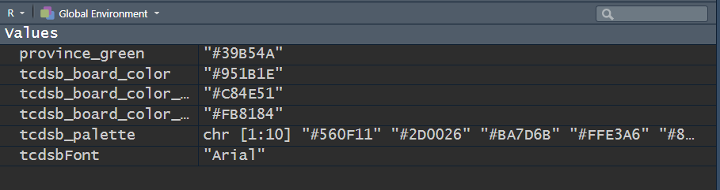

# tcdsb


<!-- README.md is generated from README.qmd. Please edit that file -->

# tcdsb

<!-- badges: start -->

[](https://github.com/grousell/tcdsb/actions/workflows/R-CMD-check.yaml)
<!-- badges: end -->

The goal of `tcdsb` is to provide report templates and ggplot themes
that align with the visual identity of the Toronto Catholic District
School Board (TCDSB).

## Installation

You can install the development version of tcdsb from
[GitHub](https://github.com/) with:

``` r
# install.packages("devtools")
devtools::install_github("grousell/tcdsb")
```

## Plot Example

Here is a basic plot:

``` r
library(dplyr)
library(ggplot2)
library(tibble)
library(tcdsb)

mtcars |> 
  head(3) |> 
  rownames_to_column("car") |> 
  ggplot(aes(x = car, y = disp)) +
  geom_col() + 
  labs(title = "Title of Plot", 
       subtitle = "Subtitle", 
       x = NULL, 
       y = "Displacement") 
```


The `tcdsb_colours_fonts` function loads the appropriate fonts and HEX
colours.

``` r
tcdsb_colours_fonts()
```



By adding `tcdsb_ggplot_theme` at the end of the code to build the plot,
a consistent theme is applied.

``` r
tcdsb_colours_fonts
```

    function (...) 
    {
        assign("tcdsb_board_color", "#951B1E", envir = .GlobalEnv)
        assign("tcdsb_board_color_20", "#C84E51", envir = .GlobalEnv)
        assign("tcdsb_board_color_40", "#FB8184", envir = .GlobalEnv)
        assign("tcdsb_palette", c("#560F11", "#2D0026", "#BA7D6B", 
            "#FFE3A6", "#8EB8C2", "#6BCAD4", "#016567", "#7DA387", 
            "#8ACA88", "#9D976E"), envir = .GlobalEnv)
        assign("province_green", "#39B54A", , envir = .GlobalEnv)
        assign("tcdsb_font", "Century Gothic", envir = .GlobalEnv)
        extrafont::loadfonts(device = "win", quiet = TRUE)
    }
    <bytecode: 0x6044418495a0>
    <environment: namespace:tcdsb>

``` r
mtcars |> 
  head(3) |> 
  rownames_to_column("car") |> 
  ggplot(aes(x = car, y = disp)) +
  geom_col() + 
  labs(title = "Title of Plot", 
       subtitle = "Subtitle", 
       x = NULL, 
       y = "Displacement") + 
  tcdsb::tcdsb_ggplot_theme()
```


Custom colours can be added to the chart using `tcdsb_board_color`.

``` r
mtcars |> 
  head(3) |> 
  rownames_to_column("car") |> 
  ggplot(aes(x = car, y = disp)) +
  geom_col(fill = tcdsb_board_color) + 
  labs(title = "Title of Plot", 
       subtitle = "Subtitle", 
       x = NULL, 
       y = "Displacement") + 
  tcdsb::tcdsb_ggplot_theme()
```


## Project Setup Example

``` r
# tcdsb::tcdsb_project_setup()
```

Creates a README file and folders for reference documents, R scripts,
assets (i.e. image files), raw and clean data.
